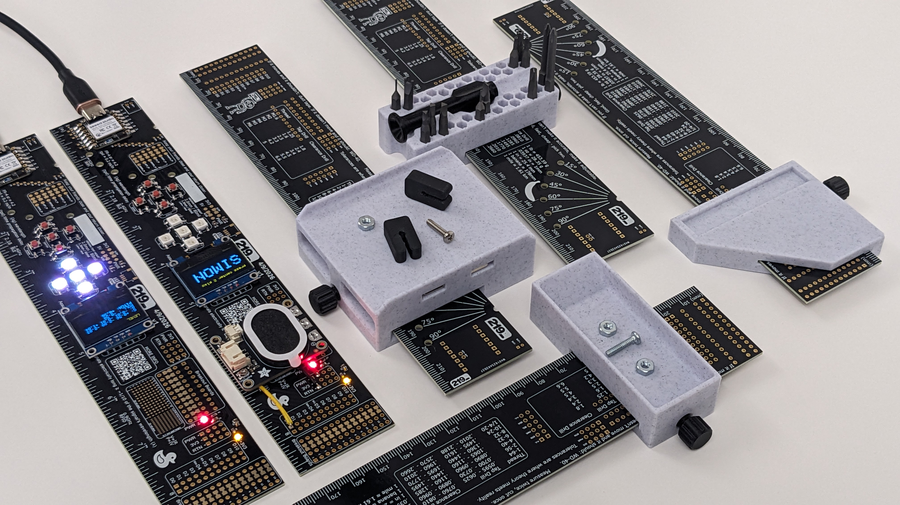

# 219 PCB Ruler

The 219 PCB Ruler is a multi-disciplinary tool and development platform. Explore this repository to find inspiration for some of the many ways that this ruler can be built out to help you solve problems and create cool projects.

Want to see the projects we've made so far? Check out the [examples folder](https://github.com/219-design/219-pcb-ruler/tree/init/firmware/ruler_lib/examples).

### Known Issues
V1 of the 219 PCB Ruler has the silk screen markings of the battery connector (P17) flipped. BAT+ and BAT- should be swapped. 
Perform a continuity test before using the battery connector to ensure the connections are correct.

## Ways to use the 219 PCB Ruler
### Bare PCB

- Metric and imperial ruler
- Mechanical and electrical references
- QR code to access additional resources

---

### Electrical Projects

Experiment with electronics by soldering on a variety of components to build your own custom projects.  

This board features footprints for:  
- Seeed Studio XIAO Series MCU module  
- Battery connector  
- Button D-pad  
- Neopixels  
- Screen  
- Bypass capacitors  
- Power LEDs  
- QWIIC connector  
- Surface-mount and through-hole protoboard areas  

#### Customization and Flexibility
The board includes **custom solder jumpers** for maximum flexibility.  
- Some jumpers are **normally open**, while others are **normally closed**.  
- These can be used to add series elements or to solder a wire directly to a connection point.  

#### Examples and Resources
Explore our [examples folder](https://github.com/219-design/219-pcb-ruler/tree/init/firmware/ruler_lib/examples) for project ideas and wiring diagrams.  

Want to design your own version or order a custom PCB?  
Visit the [electrical folder](https://github.com/219-design/219-pcb-ruler/tree/init/electrical) for **Altium design files** and **Gerbers**.  

---

### Mechanical Projects

The PCB ruler is also a great platform for **3D-printed attachments**.  

Weve designed a **3D-printable clamp** that securely grips the ruler and can be adapted for a variety of uses - such as **tool holders**, **marking tools**, or other creative mechanical add-ons.  

Explore our demo designs on [Onshape](https://cad.onshape.com/documents/a66641dbc2e63d92f0bfc751/w/f00ac217e622a64d2a372b85/e/9fa5ab666376091f7bf63026), or browse the [mechanical folder](https://github.com/219-design/219-pcb-ruler/tree/init/mechanical) for CAD files and printable models.  
