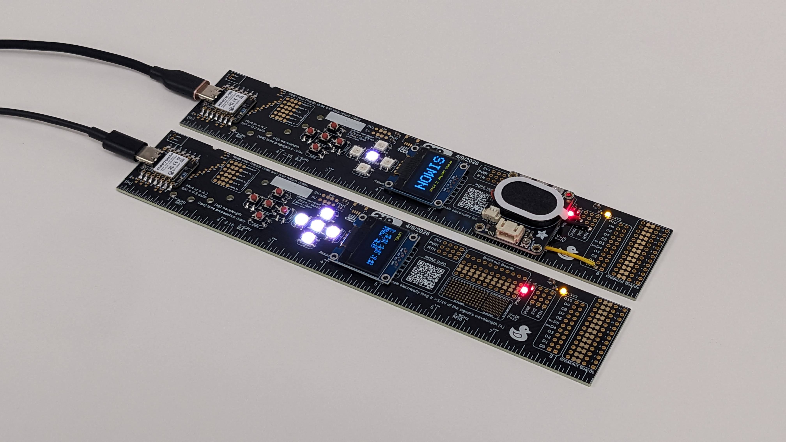

# 219 PCB Ruler Electrical Resources
This folder contains everything you need to order, build, and debug the board yourself.

Interested in a specific project? Check out the [examples folder](../firmware/ruler_lib/examples)

### Electrical Projects

Experiment with electronics by soldering on a variety of components to build your own custom projects.  

This board features footprints for:  
- Seeed Studio XIAO Series MCU module  
- Battery connector  
- Button D-pad  
- Neopixels  
- Screen  
- Bypass capacitors  
- Power LEDs  
- QWIIC connector  
- Surface-mount and through-hole protoboard areas  

#### Customization and Flexibility
The board includes **custom solder jumpers** for maximum flexibility.  
- Some jumpers are **normally open**, while others are **normally closed**.  
- These can be used to add series elements or to solder a wire directly to a connection point.  

### Assembly
So you have a 219 PCB Ruler and you want to make a cool electrical design. Where do you start?

The board is designed to be used with a [Seeed Studio XIAO Series MCU module](https://www.seeedstudio.com/xiao-series-page).
These modules are all pin compatible, so pick which one has the features you want for your project.
Mount the module to the U1 footprint. The footprint includes options to surface mount solder, TH solder, or TH socket the module. Choose what is best for your project.

Check out the BOM for part recommendations. Check the examples folder for demo specific BOMs.

#### Bypass caps
The board has four footprints (C1-C4) for bypass caps to provide some localized power.

#### Power LEDs
The board has two power LEDs: 5V (D1) and 3V3 (D2). Recommend installing these and their associated current limiting resistors (R1, R2).

#### Want to use use a LiPo battery?
Surface mount solder the MCU to U1 so the BAT- and BAT+ TH pins touch the pads on the bottom of the module.
Solder a connector to P17 and flow solder through the BAT- and BAT+ TH pads to connect the pads to the pads on the bottom of the MCU module.
Choose a battery that meets your project specs and make sure the pinout matches the connector.
Note: the silk screen label for the battery connector on v1 is flipped. See [Known Issues](../README.md#known-issues).

#### Want to use buttons?
Solder buttons to as many of the D-pad button pads as you would like. Make sure to solder the center button first if you want to use it since it will be harder to solder it after installing the outer buttons.
The buttons short to return on press. The circuit doesn't include a pull up or debouncing circuit so recommend implementing this in firmware.

#### Want to use Neopixels?
Solder Neopixels to as many of the pads as you would like (U2, U3, U4, U5, U6). Note that Neopixels works on single wire communication and ours are connected in numerical order. So if you would like to use only one Neopixel, use U2. Otherwise you will need to short the input and output pins across the unused Neopixels in the chain before the one you want to use in order for the signal to reach a pad later in the chain.

#### Want to use a Screen?
Ideally pick a screen with a pinout that matches the silk on the board. See the BOM for the one we used.
If you have a different I2C screen that you would like to use but it has a different pinout for it's 100mil header, you can reconfigure the pinout by cutting the custom jumpers under the pin. Then use the surface mount or through hole pads to wire up the correct pinout with some jumper wire.
Solder your screen into either P8 or P9. 

#### Want to use a QWIIC module?
Solder a QWIIC connector to J1 and plug in any QWIIC module. This footprint is already wired up to power and I2C so it is ready to go.

#### Have a 100mil header sensor module?
There are two 100mil header breakout board sections on the board. Just solder your module to the last row of TH headers and then solder a wire from either side of the custom jumper to the desired power, return, or IO pins.
See our demos for an examples of this.

#### Have other parts?
Use one of the three breakout areas to solder TH or SMT components. Use jumper wire to connect the pins to the appropriate IO and power signals.

